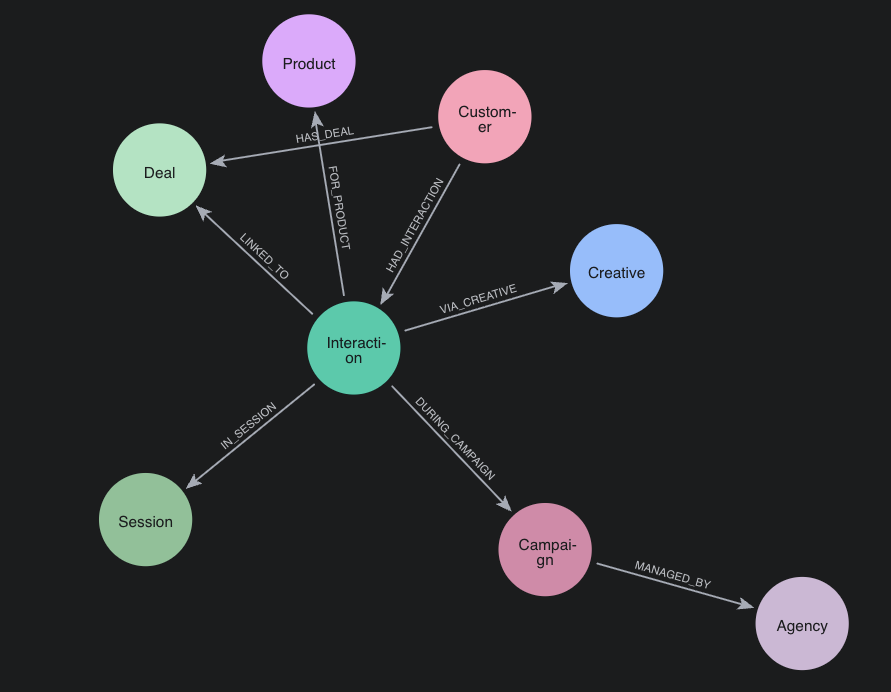

# Aura

Marketing attribution GraphRAG demo built on Neo4j Aura.

## Graph Model



## Setup

A virtual environment lives in `.venv`. The workspace is configured to use it as the default Python interpreter in Cursor/VS Code.

From a terminal, activate it:

```bash
source .venv/bin/activate
```

Install dependencies:

```bash
pip install -r requirements.txt
```

## Requirements

- Python 3.10+ recommended
